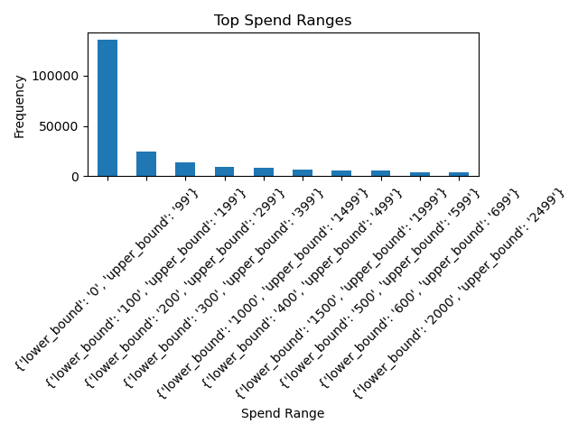
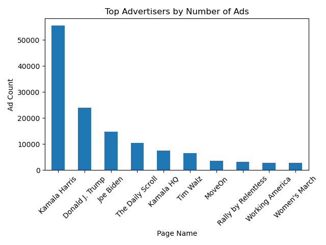
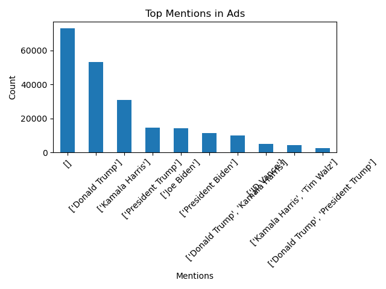
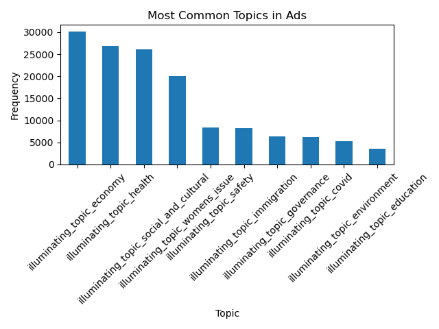
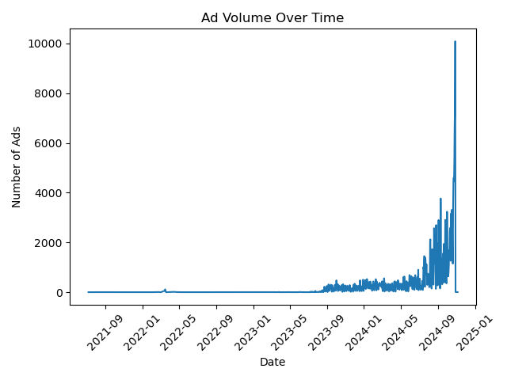

# Facebook Political Ads Analysis

##  Project Description

This project analyzes a dataset of Facebook political advertisements from the 2024 U.S. election cycle. The goal is to explore patterns in ad distribution, understand how frequently different topics and candidates appear, and examine how ad activity varies over time.

The analysis is performed using Python and pandas, with additional visualizations created to highlight key trends.

---

## ⚙️ How to Run the Project

### 1. Clone the repository

```bash
git clone https://github.com/<your-username>/<your-repo-name>.git
cd <your-repo-name>
```

---

### 2. Install dependencies

Ensure Python (3.x) is installed, then run:

```bash
pip install pandas matplotlib
```

---

### 3. Run data analysis script

This script performs descriptive analysis and saves results to a text file.

```bash
python scripts/pandas_stats.py
```

Output:

* `results/pandas_summary.txt`

---

### 4. Run visualization script

This script generates visualizations based on the dataset.

```bash
python scripts/visualizations.py
```

Output:

* `visuals/spend_distribution.png`
* `visuals/top_advertisers.png`
* `visuals/mentions.png`
* `visuals/topics.png`
* `visuals/ads_over_time.png`

---

## Summary of Findings

### 1. Spend Distribution is Concentrated in Lower Ranges

A large proportion of ads fall within lower spend ranges (e.g., $0–$99), indicating that most ads are associated with smaller budget brackets. Since spend is recorded as ranges rather than exact values, precise totals cannot be calculated.

---

### 2. A Few Organizations Publish a Large Volume of Ads

A small number of page names appear frequently in the dataset, indicating that certain organizations contribute a higher number of ads compared to others.

---

### 3. Candidate Mentions are Unevenly Distributed

Mentions of political figures such as Donald Trump, Kamala Harris, and Joe Biden occur frequently, with some individuals appearing more often than others in ad content.

---

### 4. Political Messaging Focuses on Specific Topics

The most frequently occurring topics include:

* Economy
* Health
* Social and cultural issues
* Women's issues

This shows that ad content is concentrated around a limited set of recurring themes.

---

### 5. Ad Activity is Concentrated on Specific Dates

Ad volume varies over time and is not evenly distributed. Certain dates show significantly higher activity, indicating temporal clustering of ad delivery.

---

## Visualizations

### Spend Distribution



### Top Advertisers



### Mentions



### Topics



### Ad Volume Over Time



---

##  Project Structure

```
├── data/
├── scripts/
│   ├── pandas_stats.py
│   └── visualizations.py
├── results/
├── visuals/
├── FINDINGS.md
├── DATA_QUALITY_REPORT.md
└── README.md
```

---

## Key Takeaways

* Real-world datasets often contain non-standard formats (e.g., range-based values and string-encoded lists)
* Most ads fall into lower spend brackets rather than high-spend categories
* A small number of organizations contribute a large share of total ads
* Ad content is concentrated around a few recurring political topics
* Temporal patterns show that ad activity is clustered rather than evenly distributed
